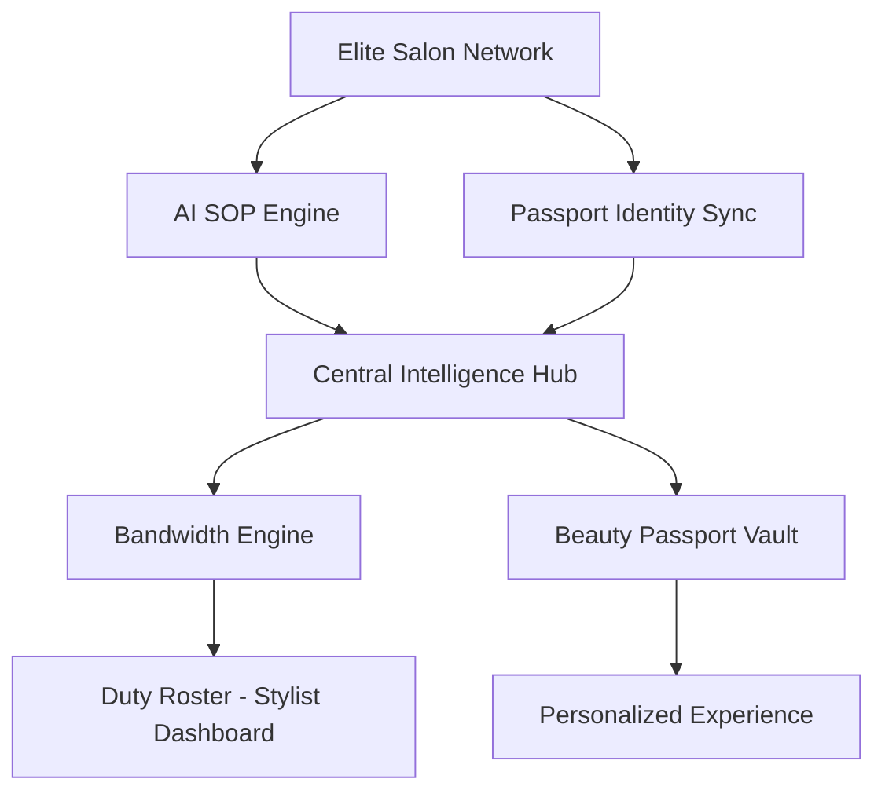
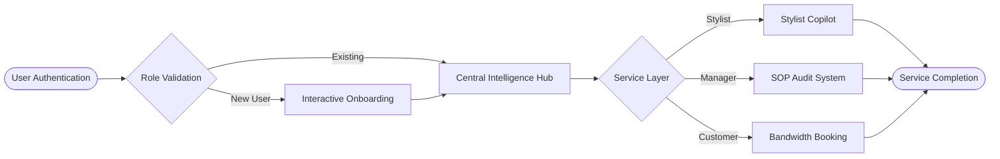

# Naturals AI Beauty Intelligence Platform

## Executive Overview
The Naturals AI Beauty Intelligence Platform is a sophisticated, enterprise-grade SaaS ecosystem designed to revolutionize salon operations through synchronized data intelligence and personalized customer care. The system integrates advanced resource allocation, automated standard operating procedures, and a robust digital identity framework to create a seamless, high-performance beauty environment.

## Core System Modules

### 1. Beauty Passport and Digital Identity Framework
The platform utilizes a secure digital vault known as the Beauty Passport to maintain comprehensive customer records and diagnostic data.
- **Identity Synchronization**: Connects a customer's physical identity with a secure digital account using standardized brand identifiers (NAT-SHA-2026-XXXX).
- **Profile Configuration**: An adaptive onboarding system that captures essential personal information and service preferences to tailor the salon experience.
- **Identity Recovery**: A systematic 'Claim Passport' protocol that allows existing legacy customers to securely transition their paper-based registries into the digital ecosystem.

### 2. Autonomous Booking and Bandwidth Engine
The booking system serves as a real-time command center for salon resource management.
- **Specialist Registry**: Dynamically retrieves the current roster of elite stylists and technicians directly from the secure data vault.
- **Intelligent Scheduling**: Utilizes a backend procedure (get_available_slots) to analyze analyst bandwidth and prevent overbooking, ensuring 100% operational efficiency.
- **Service Catalog**: Maintains an active registry of premium salon services, including durations and pricing tiers, available for real-time selection.

### 3. Professional Role-Based Access Control (RBAC)
The platform is designed with a hierarchical security model to ensure each team member has access to the tools relevant to their specific role.
- **System Administrator**: Full access to global analytics, system configurations, and cross-branch auditing.
- **Franchise Owner**: Management of business entities, franchise names, and primary salon branch locations.
- **Salon Manager**: Oversight of local branch operations, duty rosters, and specialist assignments.
- **Elite Stylist**: Access to the Stylist Copilot, personal duty rosters, and chemical formulation protocols for assigned procedures.
- **Customer**: Access to the Beauty Passport, service history, and autonomous booking tools.

### 4. Security Protocols and Guest Restrictions
The system maintains high standards of data integrity and operational security.
- **Booking Security Gate**: Guests and unauthenticated users are permitted to browse services but are restricted from securing appointment slots. The system identifies guest accounts through specific identifiers and redirects them to a mandatory sign-in portal.
- **Onboarding Logic**: The onboarding process is role-conditional. Staff members and franchise owners bypass customer-specific service questionnaires, focusing only on professional identity and branch location configuration.
- **Data Protection**: All communications and data transactions are secured using industry-standard protocols and Supabase Row-Level Security (RLS) policies.

### 5. AI SOP Engine and Trend Intelligence
- **Autonomous Audit**: Provides real-time protocol enforcement and action recognition to maintain brand standards across the network.
- **Predictive Analytics**: Combines broad social trend listening with localized salon data to predict upcoming regional beauty trends.

## System Architecture



### Operational Lifecycle Flow


## Technical Architecture

### Core Technology Stack
- **Framework**: Next.js 15+ utilizing the App Router architecture for optimal performance and SEO.
- **Database and Authentication**: Supabase integration for real-time data persistence and Firebase for secure multi-layer authentication.
- **User Interface**: Developed using Tailwind CSS for clean, professional styling and Framer Motion for high-fidelity micro-animations.
- **Graphics and Icons**: Lucide React iconography for consistent visual language.
- **Visualization**: Mermaid diagrams for architectural clarity.

### Operational Workflow
1. **User Authentication**: Firebase and Supabase dual-layer authentication.
2. **Profile Validation**: Automatic detection of onboarding status and role-based redirection.
3. **Resource Assignment**: Branch and location mapping for all staff and franchise owners.
4. **Action Deployment**: Execution of salon bookings, SOP audits, or diagnostic analysis.

## Development and Deployment

### Installation Instructions
1. **Dependency Acquisition**:
   ```bash
   npm install
   ```

### Configuration Requirements
Create a `.env.local` file in the root directory with the following variables:

**Database & Auth (Supabase)**
- `NEXT_PUBLIC_SUPABASE_URL`: Project endpoint.
- `NEXT_PUBLIC_SUPABASE_ANON_KEY`: Public anonymous API key.
- `SUPABASE_SERVICE_ROLE_KEY`: Service-level administrative key.

**Authentication (Firebase)**
- `NEXT_PUBLIC_FIREBASE_API_KEY`: Firebase web API key.
- `NEXT_PUBLIC_FIREBASE_AUTH_DOMAIN`: Firebase auth project domain.
- `NEXT_PUBLIC_FIREBASE_PROJECT_ID`: Firebase project identifier.
- `NEXT_PUBLIC_FIREBASE_STORAGE_BUCKET`: Storage project bucket.
- `NEXT_PUBLIC_FIREBASE_MESSAGING_SENDER_ID`: Cloud messaging sender ID.
- `NEXT_PUBLIC_FIREBASE_APP_ID`: Firebase application identifier.

**Intelligence Layer (AI Engine)**
- `GROQ_API_KEY`: Enterprise AI processing key for SOP analysis.
- `REPLICATE_API_TOKEN`: AI model execution token for trend listening.

### Execution
To initialize the development server and activate the platform:
```bash
npm run dev
```

---
**Precision Beauty Intelligence • Naturals AI Platform Documentation**
