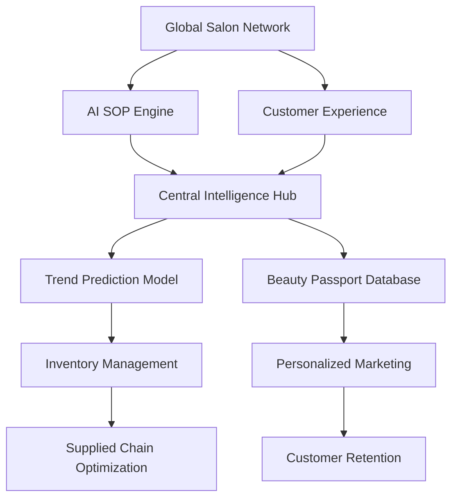
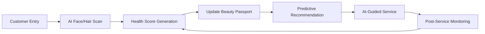
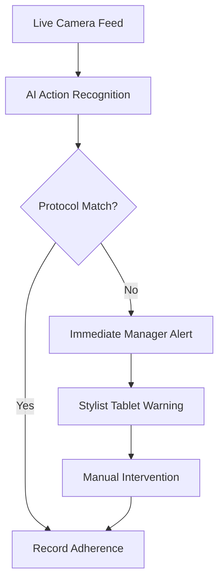

# Naturals AI Beauty Intelligence Platform

The Naturals AI Beauty Intelligence Platform is a comprehensive enterprise SaaS solution designed to revolutionize salon operations and customer personalization through advanced artificial intelligence. The platform addresses critical challenges in the salon industry, including service consistency, staff skill gaps, and hyper-localized trend prediction.

## Core Modules

### 1. AI SOP Engine
Autonomous workflow enforcement using live branch monitors. The system detects protocol violations in real-time, ensuring consistent service quality across all franchise locations.

### 2. Staff Skill Assist
An AI Stylist Copilot that provides real-time guidance and complex chemical formulation assistance. This module bridges the skill gap for semi-skilled stylists, ensuring professional results for advanced services.

### 3. Beauty Passport
A digital diagnostic profile for every customer. It tracks long-term beauty journeys, environmental exposure, and hair/skin health scores to provide hyper-personalized service recommendations.

### 4. Trend Intelligence
Regional predictive analytics that combine social listening with local data. The engine forecasts breakout trends and automates regional inventory stocking to prevent stockouts of high-demand products.

### 5. Customer Experience Tools
Immersive tools including an AR Virtual Try-On mirror and an AI Beauty Bot. These tools enhance the consultation process and provide automated, personalized beauty advice.

### 6. Training Academy
A digital certification platform with AI-graded skill tests. It ensures staff proficiency through interactive modules and live technique assessments via visual AI.

## Technical Architecture

The platform is built on a modern, high-performance stack designed for scalability and real-time processing.



## Workflows

### Customer Beauty Journey
The Customer Beauty Passport facilitates a continuous feedback loop between diagnostics and results.



### AI SOP Audit Workflow
Real-time monitoring and enforcement of standard operating procedures.



## Technology Stack

- **Framework**: Next.js 15+ (App Router)
- **Styling**: Tailwind CSS
- **Animations**: Framer Motion
- **Data Visualization**: Recharts
- **Icons**: Lucide React
- **Theme**: Premium Light Aesthetic

## Getting Started

### Prerequisites
- Node.js 18.x or higher
- npm or yarn

### Installation

1. Install dependencies:
   ```bash
   npm install
   ```

2. Run the development server:
   ```bash
   npm run dev
   ```

3. Build for production:
   ```bash
   npm run build
   ```
